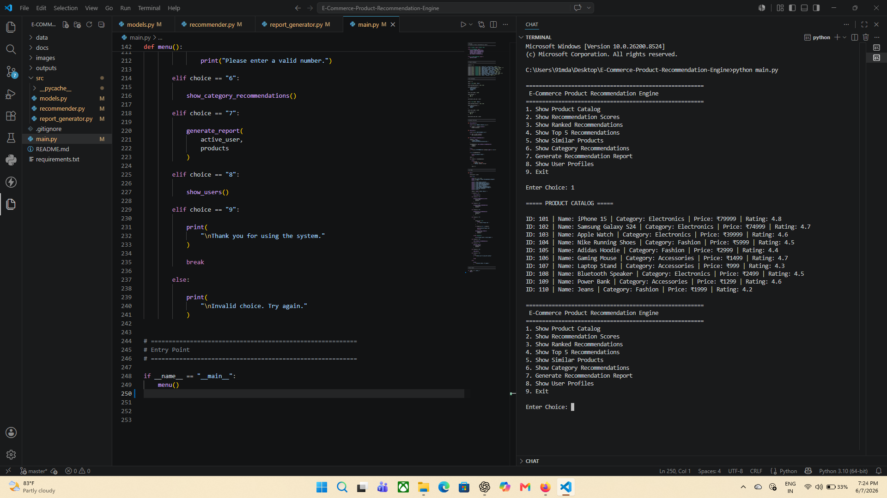
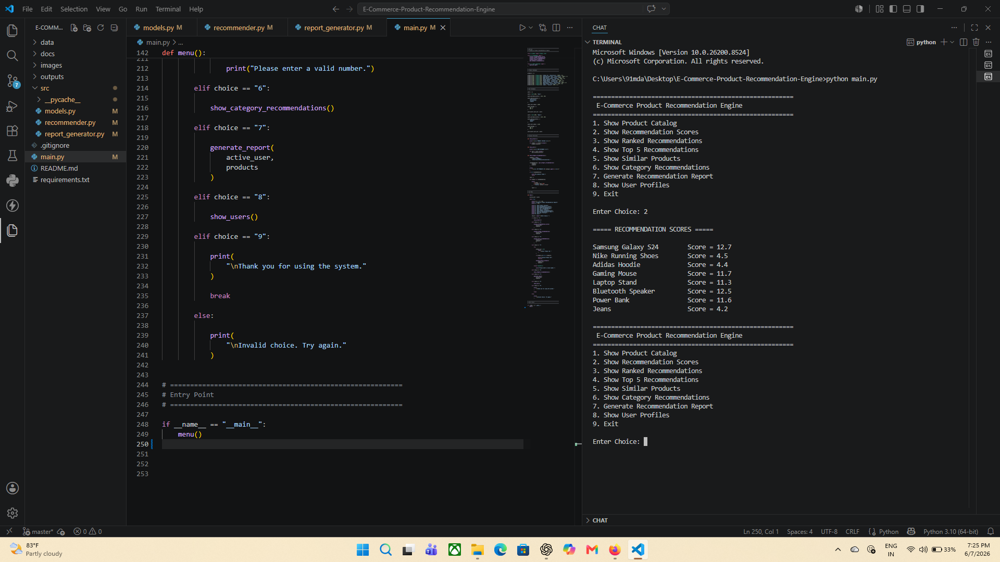
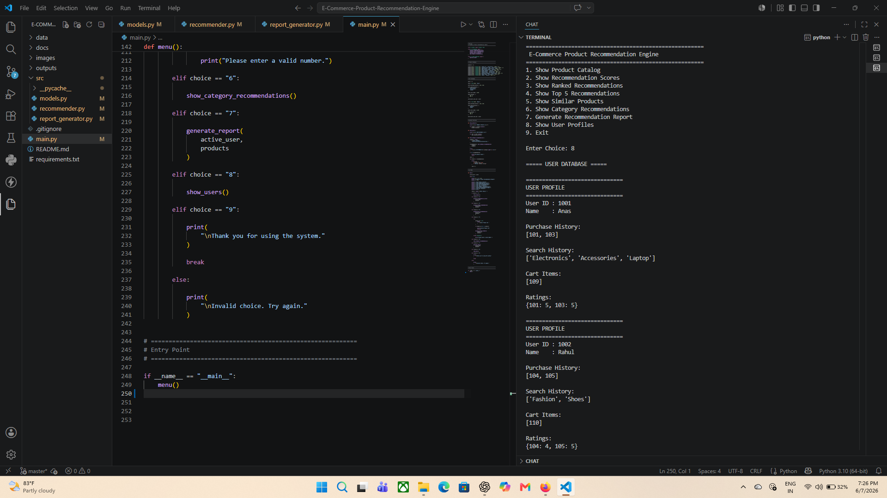

# E-Commerce Product Recommendation Engine


A Data Structures & Algorithms based E-Commerce Product Recommendation Engine built using Python. The project simulates how modern e-commerce platforms recommend products using user interactions, purchase history, search history, cart activity, product ratings, sorting algorithms, and heap-based Top-K recommendation logic.

---

# Project Overview

Online shopping platforms such as Amazon, Flipkart, Myntra, and other e-commerce applications use recommendation engines to improve user experience and increase engagement.

This project demonstrates the core logic behind recommendation systems by analyzing:

* Purchase History
* Search History
* Cart Activity
* Product Ratings
* Product Categories

and generating personalized recommendations for users.

---

# Problem Statement

Customers are often presented with thousands of products.

Finding relevant products manually can be difficult and time-consuming.

This project solves that problem by:

* Understanding user behavior
* Calculating recommendation scores
* Ranking products
* Displaying the most relevant recommendations

---

# DSA Concepts Used

| Concept               | Usage                                        |
| --------------------- | -------------------------------------------- |
| HashMap (Dictionary)  | Product and User Storage                     |
| Lists                 | Purchase History, Search History, Cart Items |
| Sets                  | Category Matching                            |
| Sorting               | Recommendation Ranking                       |
| Heap / Priority Queue | Top-K Recommendations                        |
| Scoring Algorithm     | Product Recommendation Logic                 |

---

# Features

### Product Catalog Management

* Store products using HashMaps
* Product details:

  * Product ID
  * Name
  * Category
  * Price
  * Rating

### User Interaction Tracking

* Purchase History
* Search History
* Cart Items
* Ratings

### Recommendation Engine

* Personalized recommendations
* Category-based scoring
* User behavior analysis

### Ranking Engine

* Sort recommendations based on score
* Display ranked products

### Heap-Based Top-K Recommendations

Efficient retrieval of Top-N recommendations using a Priority Queue (Heap).

### Similar Product Recommendation

Suggest products from similar categories with comparable ratings.

### Category Recommendations

Display top-rated products from a selected category.

### Report Generation

Generate recommendation reports for analysis and documentation.

---

# Project Structure

```text
E-Commerce-Product-Recommendation-Engine/
│
├── data/
│
├── images/
│   ├── catalogue.png
│   ├── recommendation_scores.png
│   └── user_database.png
│
├── outputs/
│
├── src/
│   ├── models.py
│   ├── recommender.py
│   └── report_generator.py
│
├── main.py
├── README.md
├── requirements.txt
└── .gitignore
```

---

# Architecture

```text
User Data
(Purchases, Searches, Cart)
            │
            ▼
Recommendation Scoring Engine
            │
            ▼
Sorting & Ranking Engine
            │
            ▼
Heap-Based Top K Engine
            │
            ▼
Recommended Products
```

---

# Recommendation Workflow

```text
User Activity
      │
      ▼
Purchase History
Search History
Cart Items
      │
      ▼
Similarity & Score Calculation
      │
      ▼
Product Ranking
      │
      ▼
Top Recommendations
```

---

# Screenshots

## Product Catalogue



---

## Recommendation Scores



---

## User Database



---

# Installation

Clone the repository:

```bash
git clone https://github.com/YOUR_USERNAME/E-Commerce-Product-Recommendation-Engine.git
```

Move into the project folder:

```bash
cd E-Commerce-Product-Recommendation-Engine
```

Run:

```bash
python main.py
```

---

# Sample Functionalities

* Show Product Catalog
* Show Recommendation Scores
* Show Ranked Recommendations
* Show Top-K Recommendations
* Show Similar Products
* Show Category Recommendations
* Generate Reports

---

# Learning Outcomes

This project helped demonstrate:

* Real-world use of Data Structures
* Recommendation System Design
* Heap / Priority Queue Applications
* Sorting Algorithms
* HashMap-Based Storage
* Software Modularization
* CLI Application Development
* GitHub Project Organization

---

# Future Improvements

* JSON-Based Dataset Storage
* Collaborative Filtering
* Content-Based Recommendation
* Flask API Integration
* Database Support
* Web Dashboard

---

# Author

Md Anas

Student Project focused on Data Structures, Algorithms, Software Development, and Recommendation System Design.
